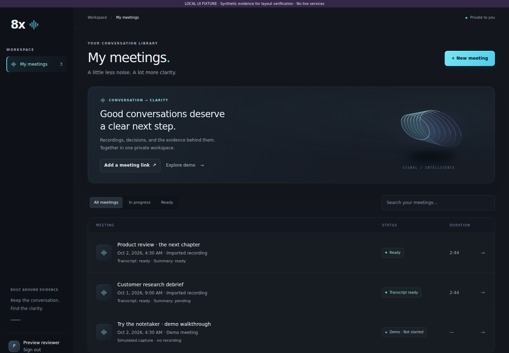
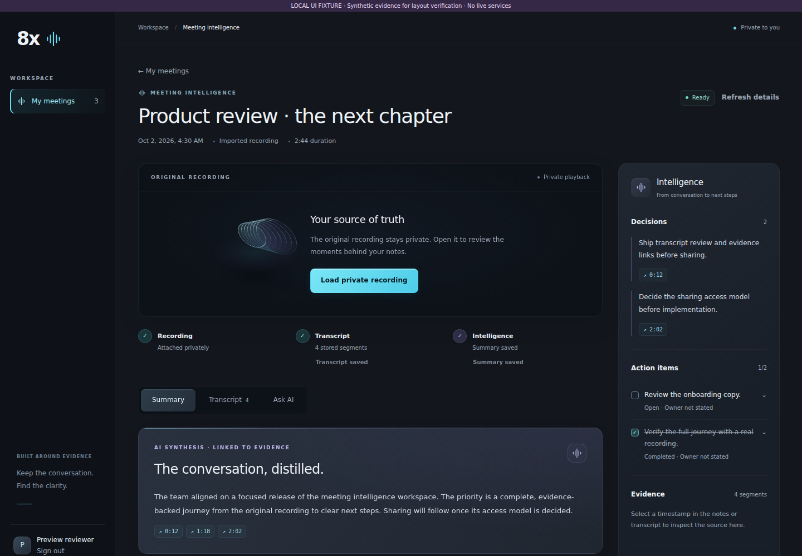
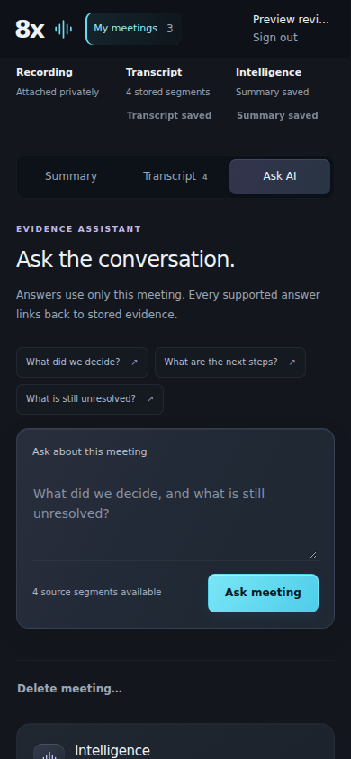

# Premium meeting workspace — presentation checkpoint

Base: `main` at `e0053908298133767ae585122b71b7516c278413`.
Branch: `feat/premium-meeting-workspace`.

## What works / implemented

The existing library → meeting → recording → transcript → summary → Ask AI flow
uses the same API, lifecycle, ownership and processing logic. No backend, auth,
proxy, database, model, budget or dependency configuration changed.

## Visual improvements

- Refined graphite shell, softer separators, clearer type scale and cyan focus/CTA
  treatments. One shared visual language across navigation, library and detail.
- A small CSS signal sculpture adds prism depth without image downloads, WebGL,
  external assets or animation dependencies. It is decorative, not an audio graph.
- Library introduction with immediate meeting-link/demo actions; restrained list
  rows, distinct status colors, improved search/filter surfaces and richer empties.
- Compact private-recording invitation, polished segmented tabs, a layered AI
  synthesis surface, source chips, topic rows and a calmer intelligence rail.
- Skeleton loading, finite processing motion, hover/pressed feedback and reduced
  motion support. No invented progress percentage or always-running decorative loop.

## UX improvements

- Question starters populate and focus an editable prompt. They never submit it or
  spend provider quota; submission remains an explicit user action.
- Transcript search highlights literal matching text. Evidence continues to resolve
  only to returned same-meeting segments, with keyboard focus and player cueing.
- Mobile source navigation clears the sticky navigation; layouts stack cleanly.
- Clear filters resets title/status filters. Imported recordings no longer receive
  the incorrect “Demo meeting” source label.
- Summary counts come from returned topics, decisions and actions. Existing action
  editors remain intact. Unavailable highlights/share are an honest secondary
  disclosure rather than a prominent empty feature section.

## Verified

- `pnpm typecheck` and `pnpm build`: passed. A first-pass JSX closing-tag error was
  caught and fixed; all subsequent builds passed.
- Eight component regression checks passed, including a new check that suggested
  questions remain editable and cause no POST until explicit submission.
- Two existing production HTTP smoke scenarios passed: unconfigured and signed-out
  pages, protected workspace redirect, API auth gates, no-store, route allowlist,
  and no fixture-secret disclosure.
- Three private Blob signer unit checks passed; these mock the storage SDK.
- Capture history, secret and whitespace checks passed. All existing raw logs are
  byte-identical to the base. React review checked stable keys, no added effects or
  runtime packages, semantic controls, focus, disabled states and existing locks.
- Production landing page visually inspected; its sign-in link reached Auth0's
  login form. A complete login/logout was not performed.
- Local Chrome inspected the actual Workspace and MeetingDetail components bundled
  in an isolated visual harness, with explicit synthetic evidence and mock APIs.
  Library/detail/summary/transcript/Ask AI rendered. Suggested prompt selection made
  zero POSTs; submitting made one, rendered an answer and two source links.
- Transcript search filtering/highlighting worked. Source selection opened the
  transcript, focused the matching segment and positioned it below the mobile
  sticky header. A source at 1:18 cued the loopback synthetic WAV to exactly 78 seconds
  once its test server supported HTTP byte ranges; this is not a live Blob/audio test.
  Desktop and 390px/320px mobile checks showed no horizontal overflow.
  Reduced-motion emulation removed panel animation. Demo consent and disabled AI
  controls remained visible, with explicit simulation/no-captured-media notices.

## Browser fixture and reproduction

The screenshots below contain **synthetic test evidence**, not real meetings or
verified AI output. The harness does not bypass app authentication: it builds a
separate loopback-only page with Next navigation shims and a mocked fetch function.
It is never mounted in the Next app. Its generated files live in ignored temporary
node_modules directories and are removed when stopped. Its synthetic silent WAV
is generated in memory only, never saved or committed as a recording.

```sh
pnpm install --frozen-lockfile
pnpm build
npm install --prefix /tmp/eightx-ui-check --no-package-lock esbuild@0.28.2 jsdom@30.1.1
UI_CHECK_TOOLS=/tmp/eightx-ui-check/node_modules node frontend/tests/meeting-intelligence.test.mjs
UI_CHECK_TOOLS=/tmp/eightx-ui-check/node_modules node frontend/tests/visual-preview.mjs
```

Open `http://127.0.0.1:4174`. Select a meeting, or use `?scenario=empty`,
`?scenario=loading`, `?scenario=error`, or `?meeting=product-review&scenario=processing`
for isolated visual states. The mock creation/lifecycle behavior is intentionally
limited: it is not a backend test. The existing component tests cover actual client
request payloads and failure behavior. Stop the harness with Ctrl+C.





## Unverified / remaining weak points

- Authenticated production library/detail, complete Auth0 login/logout, live Groq
  processing, actual private Blob playback, real citation/audio accuracy, database
  persistence and two-user ownership isolation were not reverified end to end.
  Component/mock/HTTP results are narrower and do not establish those guarantees.
- Actual media still requires the existing operator import path. Live capture is
  simulated; this checkpoint adds neither uploads nor a live meeting bot.
- Highlights/share remain unimplemented. Browser-native playback controls remain;
  a real recording is essential for the final demo's strongest presentation.
- No merge, manual deployment, plan upgrade, paid service or hackathon submission.
  Git-triggered previews may be created by the repository's existing Vercel setup.

## Files changed

- `frontend/src/app/globals.css`
- `frontend/src/components/workspace.tsx`
- `frontend/src/components/meeting-detail.tsx`
- `frontend/src/components/meeting-evidence.tsx`
- `frontend/src/components/intelligence-rail.tsx`
- `frontend/src/components/lifecycle-controls.tsx` (status styling hook only)
- `frontend/src/components/ui/button.tsx`
- `frontend/src/components/ui/signal.tsx` (new shared motif/icon/skeleton)
- `frontend/tests/meeting-intelligence.test.mjs`
- `frontend/tests/visual-preview.mjs`
- This report and three screenshots under `docs/ui-polish/`.

## Capture handoff

Read AGENTS.md, docs/agent-capture.md and CAPTURE-TEST.md before changes. Existing
`.agent-logs` entries are immutable and unchanged. There is no preceding delivered
exchange in this fresh conversation available to append.

- Wrapper session: `97ebda4f-4147-4e62-9157-06bec70c780f`.
- Current user prompt submission: `2026-10-03T00:48:23Z`, from supplied turn metadata
  `2026-10-03T06:18:23+05:30`.
- Actual selected model: `GPT-6 ASTRA`, explicitly confirmed by the user in this
  turn's model-selection question. This is user confirmation, not routing proof.
- The final response must be delivered before capture. Persist this exact prompt
  and delivered final at the next turn/session boundary with the real UTC copy time
  and the existing recorder, then commit via GitHub and read back exact bytes.
  Do not pre-log a drafted response or reconstruct old exchanges from summaries.
- No automatic or complete capture claim. Existing historical/after-timer gaps and
  the requirement for operator close-out remain as documented in CAPTURE-TEST.md.

## Recommended final polish checkpoint

Use one consented real recording with a clear decision, action and unresolved
question. Rehearse: recording → stored transcript → summary → editable action →
Ask AI → cited moment. Complete authenticated desktop/mobile and ownership QA,
then add narrowly scoped highlights/share and a concise 90-second demo narrative.
