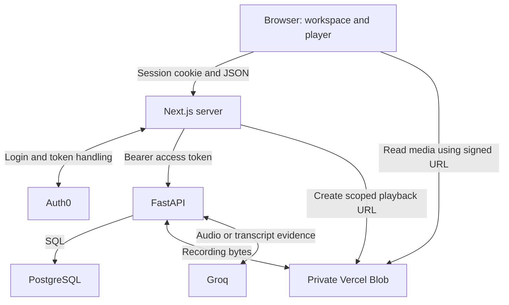

# 8x Hackathon: preparation and implementation guide

Checkpoint: **2 October 2026, approximately 01:55 IST**. Code reviewed at merged commit `28538ed8ebe031024e4053d6fd85746256d588ca`.

This guide explains the application as it exists at this checkpoint. It is a study guide, a code-reading map, and a script for demonstrating the preparation work. The successful local workflow described below was reported by Rohan during testing; this documentation pass did not independently repeat his authenticated browser session.

## 1. What we have built

The product direction is a Google Meet assistant: a user will save a meeting link, explicitly send a notetaker, and receive a recording, transcript, summary, action items, and answers linked to the meeting evidence.

**The working preparation slice starts with an imported recording.** It already supports authentication, private meeting records, private recording playback, transcription, summaries, editable actions, and cited questions. The bot that joins and records a live meeting is still pending.

A concise explanation you can give:

> “I built the authenticated recording-to-insights foundation for a meeting assistant. Each user has a private meeting library. Recordings are stored privately in Vercel Blob, and Groq generates timestamped transcripts and structured meeting notes. Summary claims and answers reference saved transcript segments, so users can jump back to the source audio. PostgreSQL persists the results, processing status, and a conservative usage allowance. The current test uses an imported recording; live Google Meet bot capture is the next integration.”

### What is tested at this checkpoint?

| Area | Evidence and status |
| --- | --- |
| Auth0 login and backend authentication | Rohan confirmed successful login after tenant migration and resolution of API 401s. |
| Local database | Meeting creation and persistence after refresh confirmed by Rohan. |
| Private recording | A roughly 12-second WAV was imported into Blob and played successfully. |
| Groq access | `verify-models` confirmed both configured models were available; Rohan confirmed the manual account checks. |
| Real transcription | Rohan explicitly confirmed successful generation. |
| Summary, question, source seeking, refresh persistence | Rohan confirmed completion of the subsequent smoke-test checklist. Action editing was conditional on the recording producing an action item. |
| Isolation, invalid tokens, retries, failed writes, cleanup | Covered by existing automated tests with provider fixtures. A fresh two-account browser test and live failure/cleanup test were not separately reported. |
| Google Meet capture | Not implemented or tested. Saving a meeting does not launch a bot. |
| Production | Configuration exists; a deployed production workflow has not been established by these local tests. |

“Everything tested” here means the requested local recording-to-AI smoke test. It does not mean every failure mode, provider account, production deployment, or live meeting path has been validated.

## 2. Components and environments

| Component | Implementation | Responsibility |
| --- | --- | --- |
| Frontend | Next.js App Router, React, TypeScript | Workspace, forms, player, transcript, notes, action editing, questions. |
| Styling | Tailwind CSS | Utility classes and shared theme tokens. |
| Frontend server | Next.js route handler and Auth0 SDK | Session handling, API forwarding, private playback URL signing. |
| Backend | Python, FastAPI, Pydantic | Validation, authorization, processing, errors, and business rules. |
| Database access | psycopg with parameterized SQL | Persistence and transactions, without an ORM. |
| Identity | Auth0 | Hosted sign-in and signed API access tokens. |
| Files | One private Vercel Blob store | Recording upload, download, playback, and deletion. |
| Speech model | Groq `whisper-large-v3-turbo` | Segment text and timestamps from audio. |
| Text model | Groq `openai/gpt-oss-20b` | Structured summaries and answers from transcript evidence. |

The checked-in pins include Next.js 16.3.8, React 19.2.8, Auth0 SDK 4.31.0, and Tailwind 4.3.3. Use the lockfiles as the authority for all dependency versions.

| Resource | Local | Intended production setup |
| --- | --- | --- |
| Application database | Docker PostgreSQL 17, host port 5433 | Supabase PostgreSQL through the transaction pooler |
| Recordings | Private Vercel Blob, `development/` paths | Same store, `production/` paths |
| Authentication | Hackathon Auth0 tenant/application | Hackathon tenant with production application URLs configured |
| AI | Groq Free account | Groq Free account, subject to actual account limits |
| Application processes | Frontend port 3000; backend port 8000 | Two separately configured Vercel projects |

**Local development is not fully offline.** Only the database and app processes run locally; authentication, recording files, and model calls use external services. Supabase is the production database choice, not the local database, authentication provider, or recording store.



The diagram separates two paths: application JSON passes through Next.js and FastAPI; browser playback reads recording bytes directly from Blob.

## 3. How the repository is organized

The backend follows **router → service → repository**.

| Layer | Owns | Example |
| --- | --- | --- |
| Router | HTTP method/path, request schema, authentication dependency, response status | [meetings.py](../backend/app/routers/meetings.py) |
| Service | Ownership checks, business rules, workflow order, transaction scope | [meeting_service.py](../backend/app/services/meeting_service.py) |
| Repository | Parameterized SQL using a supplied connection | [meeting_repository.py](../backend/app/repositories/meeting_repository.py) |
| Integration | External provider calls and provider-specific data handling | [ai.py](../backend/app/integrations/ai.py), [storage.py](../backend/app/integrations/storage.py) |

For example, `POST /meetings` validates the request and resolves the signed-in user in the router. The service handles idempotency and chooses the transaction boundary. The repository inserts or retrieves the database row. Repositories do not open connections or commit transactions themselves.

[db.py](../backend/app/db.py) provides the connection context. Successful contexts commit; exceptions roll back through psycopg. Connections have a five-second connection timeout and a ten-second SQL statement timeout. Prepared statements are disabled for compatibility with the selected production pooler. Production/VERCEL connections require TLS.

The AI call occurs outside the database transactions that claim and finish a processing job. This avoids holding a database row lock throughout model inference. The operator import and deletion paths are simpler and do perform Blob work while holding a transaction; that is a current trade-off.

On the frontend:

| File | Responsibility |
| --- | --- |
| [workspace/page.tsx](../frontend/src/app/workspace/page.tsx) | Server-side session check before rendering the workspace. |
| [workspace.tsx](../frontend/src/components/workspace.tsx) | Meeting list, creation form, selection, integration status, logout link. |
| [meeting-detail.tsx](../frontend/src/components/meeting-detail.tsx) | Playback, processing controls, evidence, action edits, questions, deletion. |
| [api.ts](../frontend/src/lib/api.ts) | Browser JSON requests to the same-origin proxy and displayable errors. |
| [route.ts](../frontend/src/app/api/backend/[...path]/route.ts) | Allowlisted authenticated forwarding to FastAPI. |
| [globals.css](../frontend/src/app/globals.css) | Tailwind import and theme tokens; components use utility classes. |

The interface uses React state and explicit refreshes. It polls saved progress every ten seconds when it observes a running job. There is no WebSocket stream or background queue behind that polling.

## 4. Authentication: how login reaches the backend

1. The user follows `/auth/login?returnTo=%2Fworkspace`.
2. [proxy.ts](../frontend/src/proxy.ts) delegates Auth0 routes/session handling to the SDK.
3. [auth0.ts](../frontend/src/lib/auth0.ts) requests the configured API audience and `openid profile email offline_access` scopes.
4. Auth0 signs the user in and returns through `/auth/callback`. The SDK manages the encrypted session cookie. `AUTH0_SECRET` protects that session; it is different from the Auth0 application's client secret.
5. The workspace server page checks the session before rendering.
6. Browser code calls `/api/backend/me`, `/api/backend/meetings`, etc. It does not manually read or attach an API access token.
7. The Next.js route handler gets an access token from the SDK and forwards it in `Authorization: Bearer ...` to FastAPI.
8. [auth.py](../backend/app/auth.py) requires RS256, fetches the tenant's public signing key through JWKS, and validates signature, issuer, audience, expiry, issued-at, and a nonempty subject.
9. The verified Auth0 `sub` is upserted into `app.users`. Its internal UUID is the owner used for application queries.

**Authentication identifies the caller; authorization decides which records that caller may access.** A valid login does not grant access to every meeting. The service queries by both meeting ID and owner ID, returning 404 for a meeting owned by someone else.

JWT decoding without verification would not establish identity. Also, the backend expects an API **access token**, not an ID token intended for the frontend application.

### The Next.js proxy is a boundary, not just a convenience

It permits only known methods and paths, checks the session, rejects non-GET requests whose Origin differs from `APP_BASE_URL`, and limits forwarded JSON bodies to 16,384 bytes. It disables redirects on backend fetches and uses `no-store` responses. The Auth0 access-token endpoint is disabled, and application code does not return provider credentials or API tokens to browser JavaScript.

The backend independently verifies identity and ownership. Knowing the backend URL does not bypass those checks.

### What happened during our setup

| Symptom | Explanation and resolution |
| --- | --- |
| Auth0 said the client could not access `https://8x-hack-api` | The new application needed User-Delegated Access to the API in Auth0. |
| Calyrn branding appeared | The projects initially shared an Auth0 tenant. Rohan moved this project's authentication to a separate account/tenant. |
| API 401s after migration | We aligned tenant/application configuration, restarted processes, and used a fresh session; Rohan reported resolution. The precise rejected token/session was not separately diagnosed. |

Keep frontend and backend `AUTH0_DOMAIN` and `AUTH0_AUDIENCE` aligned. Tenant changes can create different user subjects, so records are not automatically reassigned by matching email addresses. The current user mapping assumes one configured issuer per installation; it is not a general multi-issuer identity system.

## 5. The database: eight tables and why each exists

The two [migration files](../supabase/migrations) create a backend-only `app` schema.

| Table | Purpose and key relationship |
| --- | --- |
| `users` | Internal UUID mapped to unique Auth0 subject. |
| `meetings` | Owner, title, Meet URL, request UUID, recording metadata, and capture/transcript/summary states. |
| `transcript_segments` | Meeting, stable segment UUID, order, text, start/end seconds, nullable speaker. |
| `summaries` | One summary per meeting, structured JSON, model name. |
| `action_items` | Separate editable tasks, owner text, deadline text, completion flag, source segment IDs. |
| `questions` | Saved question and structured answer; unique request UUID within a meeting. |
| `processing_jobs` | Stage, attempts, input fingerprint, status, lease, retry time, error code. |
| `provider_budget` | One shared Groq allowance with limits, reservations, verification expiry, and active-operation lease. |

Summary content uses JSONB because overview, topics, and decisions have nested evidence references. Actions have their own rows because users edit and complete them independently. A deadline is text deliberately: “next Friday” stays “next Friday” rather than being converted into a guessed calendar date.

Foreign keys connect evidence to a meeting, with cascade deletion for its dependent records. The deletion endpoint currently **hard-deletes** the meeting; the presence of a `deleted_at` column does not mean a soft-delete workflow is implemented.

RLS is enabled and browser roles have no schema/table grants or policies. The backend connects directly through psycopg. User isolation in backend operations relies on explicit ownership checks; there is no implemented per-user RLS policy evaluating Auth0 identities.

Docker mounts the same migrations used for production, plus compatibility roles needed by their REVOKE statements. Initialization runs only when the database volume is empty. `docker compose down` retains data; removing the volume would remove local data. Future migrations must be applied explicitly to an existing database.

## 6. Save meeting: metadata, validation, and duplicate prevention

Saving a meeting creates metadata only. The backend validates a nonblank title of at most 160 characters and a URL matching the expected `https://meet.google.com/abc-defg-hij` shape. It does not contact Google to prove the link exists.

The browser creates a request UUID and retains it for a retry of the same submission. A database uniqueness constraint on `(owner_id, request_id)` prevents duplicate creation for that request. If the request UUID already exists with the same content, the service returns the existing meeting. Reusing it with different content returns `request_conflict`.

This is **idempotency**: retrying the same logical submission does not create another row. Two intentional saves with different request UUIDs can still create two meetings with the same Meet URL.

Initial states are capture `not_started`, transcription `pending`, summary `pending`. Selecting a meeting is frontend state; the workspace URL does not contain its UUID. For the import command, obtain the UUID from the signed-in `/api/backend/meetings` response.

## 7. Recording import, private playback, and deletion

### Operator import

The current test entry point is [recording_service.py](../backend/app/services/recording_service.py), called by `python -m app.admin import-recording`.

It reads the local file with a size bound, validates a complete PCM WAV using Python's `wave` module, calculates duration from frame count and sample rate, and accepts at most 180 seconds and 24,000,000 bytes. There is no 30-second minimum; the roughly 12-second test clip is valid.

The service locks the target meeting, requires it to be empty and not processing, and uploads privately using the Python Blob SDK. The path has this structure:

```text
development/<meeting UUID>/<random recording UUID>.wav
```

It then saves the path, byte count, duration, and capture state `stopped` in PostgreSQL. If the database work fails after a successful upload, it attempts Blob deletion as compensation. Blob and PostgreSQL do not share a transaction, so this is not a guarantee that no orphan can ever exist.

This CLI is a trusted operator tool with database/storage credentials. It does not perform an end-user Auth0 ownership check and is not exposed as a public upload endpoint.

### Private playback

1. The browser requests `/api/backend/meetings/<id>/playback`.
2. FastAPI verifies the caller owns that meeting and returns its recording pathname plus expiry to Next.js.
3. [blob.ts](../frontend/src/lib/blob.ts) validates the descriptor and signs a private **GET for that exact path**, using the server-only Blob credential.
4. The browser receives the signed URL and the media element fetches bytes directly from Blob.

Default expiry is 300 seconds. The signing layer accepts 30–600 seconds. An expired URL can be replaced with **Refresh playback link**; renewal repeats authorization. It is not an automatic continuously renewed stream.

A signed URL is temporary bearer access: anyone holding it may use it while valid. It is not a public bucket, and it is not a guarantee that an authorized listener cannot copy the recording. Our provider credentials never become that URL's browser-side value.

### Why use one Blob store?

It keeps local and production storage behavior the same. Environment prefixes distinguish uploads. Sharing the store does **not** share database rows: the local and production meeting libraries remain separate.

Deletion checks ownership and blocks active capture/processing. It deletes a same-environment recording before deleting the database row, preserving metadata when storage cleanup fails so the operation can be retried. If a local record references a `production/` file, the storage adapter intentionally skips deleting that production file. The adapter's environment guard is not a substitute for ownership checks.

## 8. Generate transcript: the full request

```mermaid
sequenceDiagram
  participant UI as Browser
  participant API as App servers
  participant DB as PostgreSQL
  participant Blob as Private Blob
  participant AI as Groq
  UI->>API: Generate transcript
  API->>DB: Check owner, media, budget; claim job
  DB-->>API: Persist running state and lease
  API->>Blob: Read private recording
  Blob-->>API: Audio bytes
  API->>AI: Transcribe audio with segment timestamps
  AI-->>API: Segment text and times
  API->>DB: Save validated segments and ready state together
  API-->>UI: Ready; reload saved evidence
```

“App servers” combines the Next.js authenticated forwarder and FastAPI processing service in this diagram; their separate roles are described above.

Before inference, the service checks ownership, recording metadata, stopped capture state, size/duration limits, and a configured Groq key. The job service then claims budget and processing rights atomically.

The backend downloads the private Blob, checks its size, and sends `(filename, bytes)` to Groq. Groq is not asked to fetch a localhost recording URL. The speech request uses `verbose_json`, segment timestamps, and temperature zero.

Returned segments are validated for nonempty text, finite/nonnegative timestamps, end after start, ordering by start, and compatibility with the saved duration. Segment IDs are deterministic UUIDv5 values derived from meeting UUID plus segment index. Text, timing, and IDs are saved in one transaction with completion status.

The speaker remains `null`: **speaker recognition/diarization is not implemented**. Transcription timestamps come from the speech model and are checked for valid bounds; those checks do not prove word-perfect alignment.

A ready transcript is reused. Refreshing reads saved results and does not launch inference again.

## 9. Summary, actions, questions, and evidence links

### Summary

The service loads only the selected meeting's transcript. It sends the text model a system instruction plus evidence entries containing `id` and `text`. It requests strict JSON Schema with:

- An overview.
- Topics and decisions.
- Action items containing task text, optional owner, optional deadline, and source IDs.

The prompt treats transcript/question text as untrusted data and asks the model to use only the evidence. It forbids invented speakers, timestamps, task owners, and deadlines. Empty topics/decisions/actions are allowed when absent.

[evidence_schemas.py](../backend/app/evidence_schemas.py) then independently validates the response: structured types, nonempty cited summary items, known segment IDs, bounded content, and source wording for generated task owners/deadlines. Generated owner/deadline strings must appear in the cited text; unspecified fields remain null.

Summary content and separate action rows commit together with job completion. User edits update action text, owner, deadline, and completion status without a new AI request; original source links remain attached. Edits are user-authored and can differ from the original evidence. There is no implemented edit-history log.

### Questions

Each question has a request UUID for deduplication. The model receives the current meeting's transcript segments and that question. It does not receive other users' meetings, browse the web, search a vector database, or build on previous questions as a chat history.

The answer schema contains `answer`, `supported`, and `source_segment_ids`. A supported answer must have text and sources. An unsupported answer is normalized to “This meeting does not contain enough information to answer that question,” with no citations. Question and answer are persisted together with the model name.

This is transcript-grounded generation using the whole short transcript, **not an implemented embeddings/RAG retrieval pipeline**. Evidence request payloads above 20,000 serialized UTF-8 bytes are rejected instead of silently truncating the meeting.

### How clicking a citation reaches the audio

The text model cites segment IDs rather than inventing timestamps. The frontend resolves an ID to its saved transcript segment and assigns the player's `currentTime` to that segment's `start_seconds`. If a playback URL is not loaded, it obtains one and applies the pending seek after metadata loads.

Illustrative relationship:

| Stored transcript | Generated source | Player behavior |
| --- | --- | --- |
| Segment UUID, “Rohan will finish the form by Thursday,” start 4.2 seconds | Action item references that UUID | Source button seeks to 4.2 seconds |

Valid IDs guarantee that references belong to this meeting. They do **not** mathematically prove the generated claim is supported by the cited words. Prompt instructions, validation, and human review reduce errors; they do not eliminate hallucinations.

## 10. Usage budgets: why the test was initially blocked

The application has a local guard to support the project's zero-budget requirement. It cannot inspect billing eligibility or the complete remaining Groq balance automatically.

| Check | Meaning |
| --- | --- |
| `verify-models` | Lists models using the key and checks that the two configured names are present. It performs no inference and verifies neither plan nor quota. |
| Manual account check | Operator checks the actual Free plan and remaining model-specific allowances. |
| `approve-groq-budget` | Saves a conservative, expiring application allowance in the configured database. |

The allowance is shared by all users of that database, not separately granted per meeting or user. It expires in 1–24 hours and does not refill automatically. Approval is a local operator command, with no public HTTP grant endpoint. It records the operator's assertion; it is not cryptographic proof of a free account.

Before provider work, a row lock prevents competing requests from reserving the same budget concurrently. Reservations are committed along with the job claim.

| Resource | Current reservation |
| --- | --- |
| Transcription audio | **180 seconds per attempt**, even for a 12-second clip. |
| Text requests | One for each summary or question attempt. |
| Text token capacity | Serialized request payload bytes + 4,096 maximum completion tokens + 1,024 protocol allowance. |

The token capacity is deliberately conservative, not a tokenizer count or actual Groq usage report. A five-request allowance does not guarantee five requests fit: token capacity may run out first. Each applicable dimension must have space.

We initially approved 120 audio seconds. The code required 180, so it returned `quota_exhausted` **before** calling Groq. Raising the local allowance to 180 resolved that mismatch. That error did not establish that the Groq account itself had run out of quota.

Once a job is accepted, its reservation is retained on success or failure, including uncertain provider outcomes. This avoids assuming a failed response consumed nothing. New approval adds the requested available headroom above existing reserved totals; it does not erase reservation history. It can replenish app headroom, so the operator must keep it within actual remaining provider allowance.

The current test grant lasts two hours. Expiry blocks new processing; saved playback, transcripts, summaries, and answers remain available. Retrying the same ready operation reuses its saved output.

## 11. Processing reliability and its limits

An operation runs inside its HTTP request; there is no Celery worker, message broker, scheduled retry loop, or unattended processing daemon.

The job service persists a five-minute lease, unique lease token, input hash, attempt count, and running state before external work. The budget row permits one active Groq operation at a time across this database. A repeated request sees existing progress rather than starting parallel inference.

Completion requires the matching lease token and a running job. Once a newer attempt owns the job, an older attempt cannot save over it. Output insertion and completion status share a transaction, so a failed evidence write cannot leave a falsely successful completion.

Known failures are saved and release the active-operation slot. Ordinary failures impose a 60-second cooldown. There are at most three attempts per operation, and at most twenty distinct question jobs per meeting. SDK retries are disabled; users explicitly retry through the application.

If a process disappears mid-request, a job may remain `running`. After the lease expires, **Recover interrupted work** marks expired work failed so it can be retried. Recovery does not refund its reservation or reset its attempt count. It does not automatically rerun the model.

Transcription and summary are separate stages. If summary validation fails, the saved transcript survives and the user retries only the summary. Groq transport timeout is configured to 75 seconds; the frontend backend-fetch timeout is 240 seconds; backend deployment configuration requests up to 300 seconds. These settings are not proof that a hosted deployment has been verified.

This is bounded recovery with duplicate protection, not an exactly-once provider execution guarantee. A timeout can occur after a provider processed a request, and a permitted retry can call it again. A local lease also cannot cancel remote work that outlives its request.

## 12. API map

Browser requests prepend `/api/backend` to the protected paths below. FastAPI exposes the paths without that prefix.

| Method and backend path | Purpose |
| --- | --- |
| `GET /health` | Public process/configuration flags; does not test database or provider connectivity. |
| `GET /me` | Verify identity and return internal user ID. |
| `GET /integrations` | Show configured AI key, local budget status, and capture-unavailable status. |
| `GET /meetings` | Owner's latest 100 meetings; pagination is not implemented. |
| `POST /meetings` | Validate and idempotently save meeting metadata. |
| `GET /meetings/{id}` | Owner-scoped detail. |
| `DELETE /meetings/{id}` | Authorized recording cleanup and meeting deletion. |
| `GET /meetings/{id}/playback` | Owner-checked descriptor; Next.js turns it into a signed URL. |
| `GET /meetings/{id}/evidence` | Saved transcript, summary, actions, questions, and job progress. |
| `POST /meetings/{id}/transcribe` | Generate and persist transcript. |
| `POST /meetings/{id}/summarize` | Generate and persist summary/actions. |
| `POST /meetings/{id}/questions` | Generate/persist or reuse an answer. |
| `PATCH /meetings/{id}/actions/{action_id}` | Edit an owned meeting's action. |
| `POST /meetings/{id}/recover` | Recover expired processing state. |
| `POST /meetings/{id}/send` or `/stop` | Ownership checked, then 503; no bot request is sent. |

## 13. Configuration and useful commands

You maintain `frontend/.env.local` and `backend/.env.local` yourself. No environment files or credentials belong in the repository. The following is a variable inventory, not a file to commit.

| Variable | Where | Meaning |
| --- | --- | --- |
| `AUTH0_DOMAIN` | Both | Hackathon tenant hostname. |
| `AUTH0_AUDIENCE` | Both | Exact API identifier, currently `https://8x-hack-api`. |
| `AUTH0_CLIENT_ID`, `AUTH0_CLIENT_SECRET` | Frontend | Regular Web Application credentials. |
| `AUTH0_SECRET` | Frontend | Random secret for encrypted SDK sessions. |
| `APP_BASE_URL` | Frontend | Local origin `http://localhost:3000`. |
| `BACKEND_URL` | Frontend | Local FastAPI origin `http://localhost:8000`. |
| `DATABASE_URL` | Backend | Docker database locally; Supabase connection in production. |
| `APP_ENV` | Backend | `development` locally, `production` when hosted. |
| `BLOB_READ_WRITE_TOKEN` | Both, server code only | Credential for the same private store. |
| `GROQ_API_KEY` | Backend | Key for the verified account. |
| `GROQ_TRANSCRIPTION_MODEL` | Backend, optional | Defaults to `whisper-large-v3-turbo`. |
| `GROQ_TEXT_MODEL` | Backend, optional | Defaults to `openai/gpt-oss-20b`. |
| `PLAYBACK_URL_SECONDS` | Backend, optional | Default 300; use 30–600 for compatibility with the signing layer. |

No `NEXT_PUBLIC_` credentials are required. Old Supabase Storage service-role/bucket settings and filesystem-storage settings are not used. Backend settings are cached; restart the backend after changes. Existing process environment variables take precedence over its local file, which is not loaded in production/VERCEL mode.

From the repository root, after installing dependencies:

```bash
docker compose up -d --wait db
pnpm dev
```

From `backend`, to attach a WAV to an empty meeting:

```bash
uv run python -m app.admin import-recording --meeting-id YOUR_MEETING_UUID --file "C:/Users/YourName/Downloads/recording.wav"
```

To check configured model access:

```bash
uv run python -m app.admin verify-models
```

The grant used for the initial smoke test was:

```bash
uv run python -m app.admin approve-groq-budget --audio-seconds 180 --text-requests 5 --text-tokens 20000 --hours 2 --note "Manually checked Groq Free plan and available quotas for local testing." --confirm-free-no-payment
```

This is a historical test allowance, not a universal Groq quota or a command to rerun blindly. Use headroom that fits the account when approving another grant. It allows one transcription reservation, with text work subject to both request and token capacity. No restart is needed after a budget grant because it is read from the database.

## 14. Troubleshooting without guessing

| Error or symptom | What it means | Next action |
| --- | --- | --- |
| `free_plan_unverified` | No local grant or its expiry passed | After actual account checks, approve a short-lived grant in the same database used by the backend. |
| `quota_exhausted` | An app reservation exceeds local headroom | Inspect `/integrations` remaining values and the reservation rules above. This is not proof of Groq exhaustion. |
| `provider_quota` | Groq itself rejected the request at its limit | Review actual usage and wait as required; another local grant does not override Groq. |
| `provider_access` | Groq rejected credentials or model permission | Check key/project/model access. |
| `invalid_evidence` | Output or timestamps failed validation | Earlier stages remain saved; inspect the input and error before spending another attempt. |
| `provider_busy` / `processing_active` | An operation already owns a live lease | Refresh rather than repeatedly clicking. |
| `retry_later` | Failure cooldown still active | Wait at least the saved retry interval. |
| `retry_exhausted` | Three attempts consumed for that job | Diagnose the failure; budget renewal does not reset the attempts. |
| `recording_not_ready` | No validated, attached recording | Import into the intended empty meeting. Saving the URL alone is insufficient. |
| Playback error after waiting | Signed URL may have expired | Choose Refresh playback link. |
| `database_unavailable` | Database connection/query failed | Check Docker, URL, and applied migrations. |
| `capture_verification_required` | Capture adapter is unavailable | Expected today; API key entry alone will not implement it. |

The API normally returns `detail.code`, a user-facing message, and a retryable flag. Raw provider/SQL errors are not intentionally exposed by these handlers. A retryable dependency error still remains subject to cooldown, attempts, and budget.

## 15. Tests and evidence you can explain

The previous storage implementation validation recorded 29 backend tests and three frontend signing tests passing, plus type checking, build, HTTP smoke checks, and lint/secret checks. These were not rerun just to write this guide.

| Test area | What it exercises | Limit of the evidence |
| --- | --- | --- |
| Backend authentication | Good and bad signatures/claims | Test JWKS and generated test keys, not a live tenant login. |
| SQL/ownership | Two-user isolation, constraints, persistence, idempotency | Earlier container runs used PGlite; not proof of native PostgreSQL concurrent locking under load. |
| Processing | Cited outputs, failure recovery, retained reservations, stale attempt rejection, atomic writes | Mock provider responses. |
| Blob adapter | Private upload/get/delete, invalid paths, failed-import cleanup, environment deletion guard | Fixture SDK behavior. |
| Frontend signing | One private read path, bounded expiry, invalid descriptors blocked | Mocked signing SDK. |
| HTTP smoke | Protected routes, redirects, proxy allowlist, no-store, fixture-secret exclusion | No real Auth0 or visual browser interaction. |
| Rohan's local smoke test | Real Auth0, Docker app data, Blob playback, Groq transcript/notes/questions, source links and persistence | One short recording and the reported checklist, not a comprehensive production or load test. |

Existing commands from the repository root:

```bash
pnpm typecheck
pnpm build
pnpm --filter frontend test:blob
pnpm check:backend
pnpm test:backend
pnpm test:frontend-http
pnpm check:secrets
```

The HTTP check needs a built frontend. Backend tests use a disposable database. **Never point `TEST_DATABASE_URL` at your app or production database**: fixtures create schemas and truncate data. Earlier automated browser verification was blocked in the agent environment; Rohan's later local manual checks are separate evidence.

## 16. Five-minute video walkthrough

Before recording, use the already tested local setup and a recording you may share. Ensure a valid allowance if demonstrating fresh inference. Keep credentials and signed URLs out of the video. If showing saved results, describe them as saved results rather than pretending generation is happening live.

| Time | Show | Explain |
| --- | --- | --- |
| 0:00–0:30 | Workspace and preparation scope | “This is the recording-to-insights foundation of a live meeting assistant. The current recording is imported; bot capture is pending.” |
| 0:30–1:00 | Sign-in and private meeting library | “Auth0 manages login. The backend validates the access token and checks meeting ownership on every protected operation.” |
| 1:00–1:40 | Selected meeting and private playback | “Metadata lives in local PostgreSQL. Audio lives in private Blob. Playback gets a short-lived URL after authorization.” |
| 1:40–2:20 | Transcript and timestamp click | “Groq returned segment text/times. We validate and persist them. Clicking this timestamp seeks to the saved audio position.” |
| 2:20–3:00 | Summary, decision, action edit if present | “Notes are structured JSON with source IDs. Actions are separate editable rows; unstated owners/deadlines are not invented.” |
| 3:00–3:40 | One question and citation | “The answer uses this meeting's transcript. The citation resolves to a saved segment, then to the audio.” |
| 3:40–4:10 | Refresh and retained results | “These are database-backed results. Refresh does not rerun the models.” |
| 4:10–4:40 | Architecture diagram or folder structure | “Routers handle HTTP, services enforce workflow and transactions, repositories execute SQL, and integrations wrap providers.” |
| 4:40–5:00 | Processing/budget explanation and next step | “Requests reserve conservative capacity and persist recovery state. Next is the manually triggered Google Meet bot integration.” |

For a three-minute version, shorten the architecture and reliability explanations. Do not demonstrate an action item your recording did not contain. A 12-second recording proves the path; it is not a claim of long-meeting quality.

## 17. Questions you should be able to answer

**Why both Next.js and FastAPI?** Next.js owns the web experience and Auth0 session boundary. FastAPI owns domain rules, SQL persistence, and Python provider integrations. The proxy keeps bearer-token handling out of application browser code.

**Why router/service/repository?** It makes HTTP concerns, workflow decisions, and SQL distinct. A service can call multiple repositories in one transaction without making routers responsible for business rules.

**Why Docker locally and Supabase in production?** Both provide PostgreSQL for the same schema. Docker gives isolated local state; Supabase supplies the intended hosted database. This project does not use Supabase Auth or Storage.

**Why not save audio in PostgreSQL?** The database stores ownership, metadata, and structured evidence. Blob stores the media bytes and serves playback independently from JSON API requests.

**How is a recording private?** The store is private, the API checks ownership, and Next.js signs one exact read path with an expiry. The URL itself remains temporary bearer access.

**How do you prevent duplicated model work?** Stable request IDs, saved stage state, database job keys, and live leases prevent normal duplicate starts. This is not an exactly-once guarantee after uncertain network outcomes.

**What stops two requests spending the same budget?** A database row lock serializes reservations. The same claim transaction also persists the active lease and running job.

**Why did 12 seconds need a 180-second allowance?** The current guard reserves the maximum allowed recording duration for every attempt. It is conservative and simple, but over-reserves for short recordings. It is not measured billing usage.

**What happens if summary generation fails?** The transcript remains ready. Summary failure is persisted, and an eligible retry only runs that stage, consuming another reservation.

**What happens if the server dies after calling Groq?** The stored running job can be recovered after its lease expires. We retain the reservation because provider usage may already have occurred. A newer lease prevents a stale completion from overwriting its result.

**Can the AI still hallucinate?** Yes. Strict schemas and valid source IDs constrain outputs, but do not prove semantic truth. We require source references and make audio verification easy.

**Does Q&A use RAG, embeddings, or conversation memory?** No. It sends this short meeting's saved transcript with the current question. Larger transcript retrieval is not implemented.

**Can it identify speakers or join a meeting now?** No speaker diarization and no working bot capture yet. The import command establishes media metadata for testing the downstream flow.

**Is the preparation build production-ready?** It demonstrates the local core path. Production deployment, real live capture, native concurrency/load behavior, broader security/runtime testing, and long-meeting handling remain separate work.

## 18. Where to go next

The recording-to-AI preparation smoke test is complete as reported by Rohan. The next product integration is the manually triggered Google Meet notetaker: create/join, admission, stop, verified duration limits, authenticated webhooks, media transfer into the existing Blob/meeting contract, and failure recovery.

Recall is the proposed capture provider in the current code/UI, not a verified working integration. Actual free access, account region, recording/retention behavior, and the public webhook arrangement still need confirmation. No Recall API key is currently consumed, and `/webhooks/recall` is not implemented.

Calendar sync, automatic joining, other meeting platforms, speaker identification, long recordings, streaming transcripts, and autonomous background retries are outside this preparation slice. The checked-in Vercel configurations disable Git-triggered deployment during preparation. This guide does not start the assignment timer, deploy, or submit anything.

For code study, read in this order: [workspace](../frontend/src/components/workspace.tsx), [proxy route](../frontend/src/app/api/backend/[...path]/route.ts), [authentication](../backend/app/auth.py), [meeting service](../backend/app/services/meeting_service.py), [recording service](../backend/app/services/recording_service.py), [evidence service](../backend/app/services/evidence_service.py), [job service](../backend/app/services/job_service.py), [AI adapter](../backend/app/integrations/ai.py), [evidence validators](../backend/app/evidence_schemas.py), then [repositories](../backend/app/repositories).

The [README](../README.md) remains the setup reference. The earlier [integration checkpoint](integration-checkpoint.md) is a historical report from before the user-run local smoke test; its blocked live-provider statements should be read with the dated evidence in this guide.
