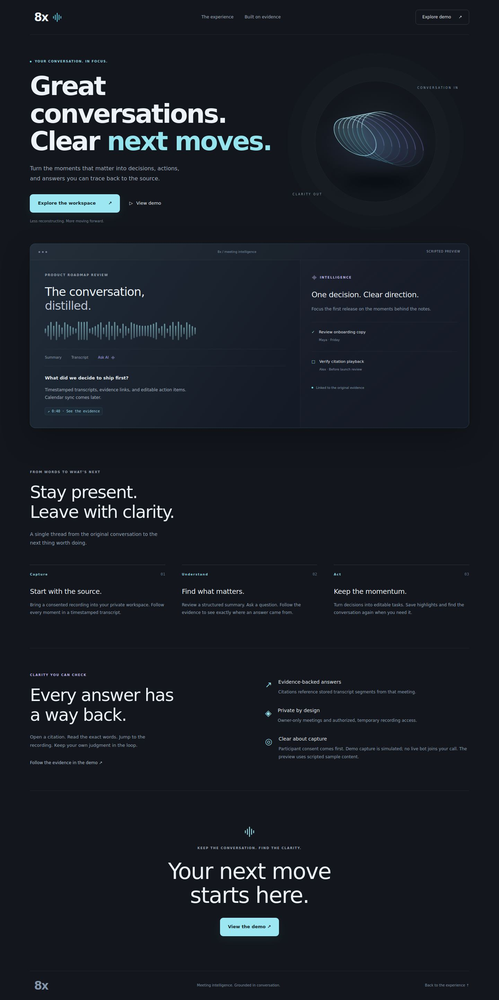
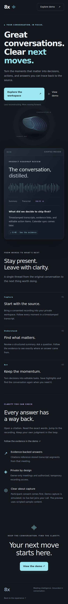
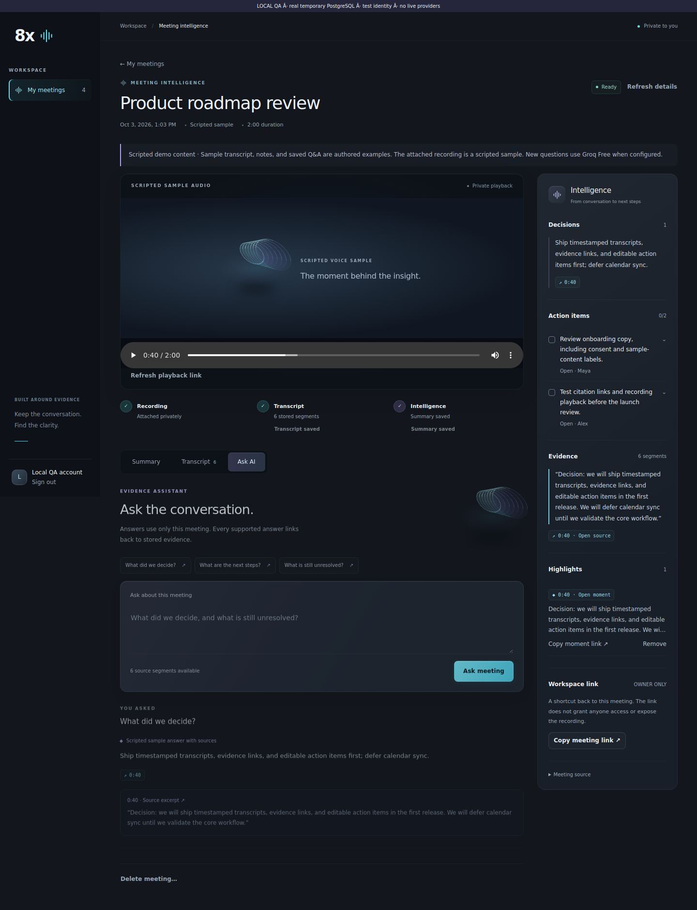
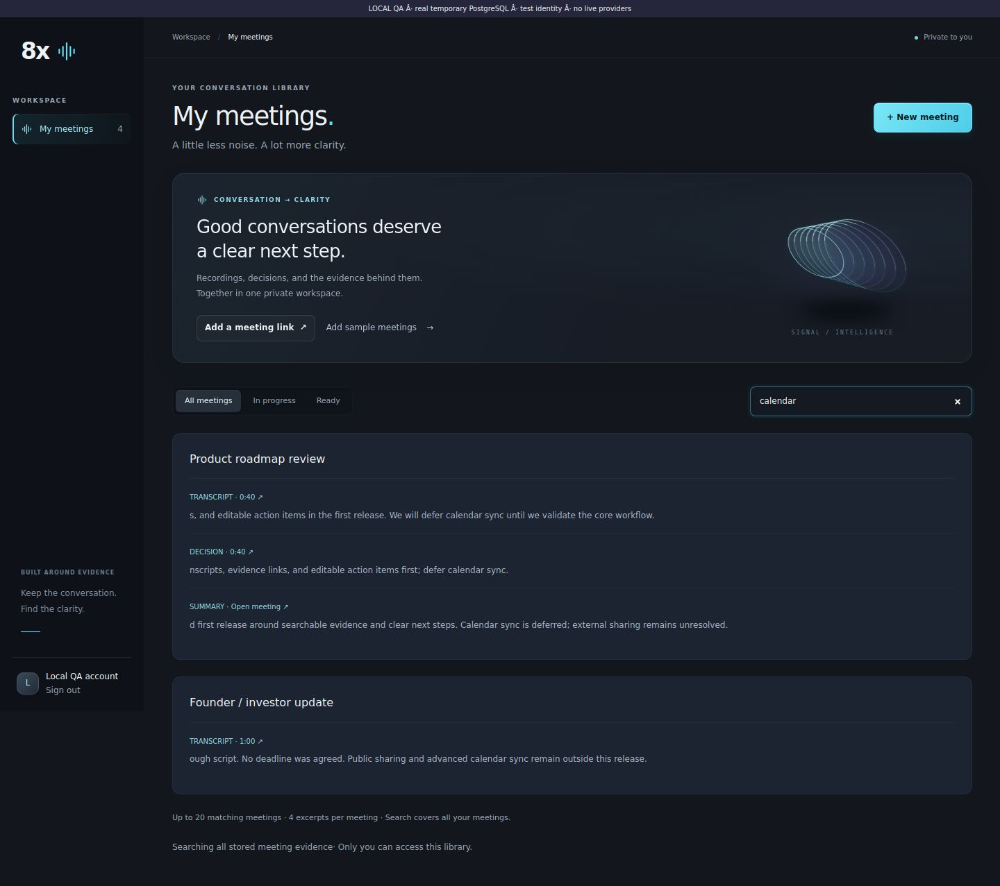
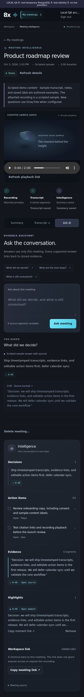

# Standalone product sprint

Base: `679bcb2ba0bc9876d0eb125d1a2a79e160654a9e` (merged premium UI checkpoint).
Branch: `feat/standalone-meeting-product`. No merge or manual production deployment.

## What works

- Public landing page with the existing graphite/cyan signal identity, selective violet depth,
  Capture → Understand → Act story, concise trust copy and real demo navigation.
- Signed-in root redirects still enter the workspace. Sign-in URL and Auth0 implementation
  are preserved. With missing local auth configuration, public CTAs open the demo instead.
- `/demo` is an interactive, read-only scripted preview. It never calls Groq or exposes private
  meeting data. Sample answers are explicitly prewritten; their buttons select source text.
- Meeting intelligence retains its existing player, tabs, summary, decisions, and task editor.
  Added visible save feedback, answer excerpts, newest answers first, saved highlights, source
  deep links, and a signal backdrop for audio-only recordings. Sample and live AI answers are
  labeled separately.
- Action text/completion/manual owner/deadline edits retain their original source IDs.
- Highlights store a segment reference, not a copied or client-selected timestamp. Composite
  foreign keys enforce same-meeting evidence; repeated saves are idempotent.
- Owner-only links use `/workspace?meeting=<id>&segment=<id>`. Copying a link does not grant
  access. There is no public sharing endpoint or media URL in copied links.
- PostgreSQL literal substring search covers titles, transcripts, summary overviews, decisions,
  and action text. It filters owner and deleted meetings before collecting matches, returns
  at most 20 meetings/4 excerpts each, and supplies timestamps only from real segment rows.
  This simple scan is appropriate to the demo's size; it is not vector or ranked semantic search.
- Opt-in `Add sample meetings` creates four clearly labeled, persistent, owner-scoped examples:
  roadmap, customer discovery, engineering planning, and founder update. The operation is
  atomic/idempotent, preserves prior edits, and makes no provider calls. It does not alter the
  simulated capture lifecycle, which still generates no evidence.

## Required migration and rollout order

Apply `supabase/migrations/202610030001_product_intelligence.sql` to the target database
**before deploying the backend**. It adds `demo_seed_key`, a per-owner unique seed index,
`app.highlights`, its composite source FK, and RLS/revoked browser-role access.

Then deploy backend and frontend through the existing reviewed workflow. No new application
environment variable, paid service, plan upgrade or credential is required by this feature.
Do not deploy the changed evidence endpoint ahead of the migration: it queries highlights.

Rollback: revert the application change and retain the additive migration/data. No destructive
schema rollback is needed. Existing `.agent-logs` entries must remain untouched.

## Demo recording preparation

Seeding initially adds authored evidence without pretending a recording exists. For a complete
media walkthrough, sign in, click **Add sample meetings**, and copy the roadmap meeting UUID.
The optional operator command uses free, local **espeak-ng** (or espeak) to speak the stored
sample transcript, pads each segment into its exact 20-second slot, and uploads the result using
the existing **private Vercel Blob** integration. No Groq request or paid speech API is used.

With the existing target database/private Blob configuration in the operator's uncommitted
`backend/.env.local`, and espeak-ng installed locally:

```bash
cd backend
uv run python -m app.admin attach-demo-recording --meeting-id <ROADMAP_MEETING_UUID>
```

Run once per sample. Existing media and active jobs are rejected. Overlong speech or changed
sample timestamp slots fail closed. Audio lives in temporary files/memory and private Blob;
no recording is committed. This is synthesized sample speech, not a captured call or proof of
transcription/diarization. Use the existing consented real-recording import/transcription path
when demonstrating real Groq transcription.

The actual speech generator and 120-second local WAV were verified. Production Blob upload
was **not** run: target credentials are unavailable in this workspace. Consequently seeded
production meetings will have no recording until the operator performs this step.

## 90-second walkthrough

1. Landing: “Stay in the conversation; every answer has a way back.”
2. Sign in → Add sample meetings → Product roadmap review. Explicitly call it a scripted demo.
3. Load the prepared private sample recording. Play a few seconds.
4. Open Summary: one clear release decision and two evidence-linked actions.
5. Edit/complete a task; reload once to show persistence.
6. Ask AI: the saved “What did we decide?” is labeled a sample answer. For a live inference,
   ask a new question only with the actual Groq Free account/budget already verified.
7. Click the answer's `0:40` citation. The decision segment highlights and playback seeks to
   the decision. Show the source excerpt rather than claiming the AI cannot be wrong.
8. Save a highlight. Copy its workspace link; explain that only the owner can open it.
9. Return to the library, search `calendar`, and open a timestamped match.

A public, login-free preview is available through View demo. It has no real recording or live
AI inference; it demonstrates navigation and the product story without an auth bypass.

## Verification

### Passed

- Frontend `pnpm typecheck`.
- Production `pnpm --filter frontend exec next build --webpack`.
- Backend **42 tests**, including real temporary PostgreSQL with every migration applied.
- Existing component regression harness and private Blob signing tests.
- Modified Python modules pass Ruff; changed source formatting and Git whitespace checks pass.
- Capture recorder: **14 tests**, canonical/history check preserves all four existing raw logs.
- Secret scan covers staged new and changed files; no env files, keys or recordings staged.
- Real production-build landing/demo in Chromium at desktop and 390px mobile widths:
  navigation, sample question → citation → selected transcript, no page errors or horizontal overflow.
- Actual Workspace/MeetingDetail components in a loopback test harness connected to real
  FastAPI/PostgreSQL: four seeds, action edit/completion + reload, highlight + reload, copied
  source links, saved question citations, grouped search → source navigation, mobile layout.
- Actual offline synthesized speech: six utterances start at 0/20/40/60/80/100 seconds, total
  120 seconds. In the browser, saved citation/highlight selected the correct evidence and
  sought real local audio to **40.0 seconds**. Attachment used a local storage adapter.
- API two-user tests reject foreign meetings, action edits and highlights; cross-meeting
  source references fail; search returns no other-owner data; SQL wildcard/injection text
  remains literal; deleted meetings are excluded.
- Existing deployment `/` responds 200; its sign-in CTA reaches Auth0. No credentials submitted.

Public browser regression command (install Playwright outside the repository):

```bash
UI_CHECK_TOOLS=/path/to/temporary/node_modules \
BROWSER_EXECUTABLE=/path/to/chromium \
PUBLIC_TEST_URL=http://localhost:3000 \
node frontend/tests/product-browser.test.mjs
```

### Limits and blockers

- Turbopack production build hit an environment worker-port permission error; the supported
  Webpack build passed. The repository's default build command is unchanged. Vercel must
  still run its normal build. Webpack emits the existing Auth0 DPoP dynamic-dependency warning.
- Local workspace harness substituted Next navigation/session plumbing and a test-signed
  identity; it used real DB/service operations. It does not verify real Auth0 OAuth or the
  production BFF end to end. Media used real speech with a local storage adapter, not Blob.
- No production migration, new authenticated/incognito deployment test, actual login/logout
  round trip, real Groq inference/quota test, or production private Blob seek was performed.
- Citation IDs are validated against the meeting; this does not prove every model sentence
  semantically follows its evidence. Source excerpts enable human review.
- No collaboration ACLs/public shares. Workspace links remain owner-only by design.
- No live capture provider or speaker diarization added. Existing short-recording limits remain.

## Screenshots

Public screenshots use the real local production build. Workspace screenshots use real
PostgreSQL sample content and a clearly labeled local test identity/storage adapter.







## Files and migrations

- Frontend: root + `/demo`, landing/demo components, existing workspace/detail/rail/types,
  global styles, BFF route allowlist/query forwarding, public browser regression.
- Backend: discovery repository/service, highlight schema/routes, evidence payload, demo
  service + shared JSON, optional demo recording service/admin command, meeting output field,
  sample-answer provenance, product security/persistence/audio tests and lifecycle assertion.
- Migration: `202610030001_product_intelligence.sql`.
- This checkpoint report and five screenshots. No dependencies/env files changed.

## Capture handoff

Read AGENTS.md, docs/agent-capture.md and CAPTURE-TEST.md before implementation. Existing
raw logs are unchanged. No preceding delivered exchange is available in this fresh conversation.
The current implementation prompt was submitted at **2026-10-03T10:22:13Z**, based on the
supplied message time. This sprint's final response cannot be recorded before delivery.
The exact selected model label has not been confirmed by user/UI/runtime metadata; no model
was inferred from the planned executor. Raw-log publication is pending that confirmation and
a post-delivery close-out under the manual wrapper protocol. No historical response, hook,
complete-capture claim, or premature final response entry was fabricated.

## Recommended final checkpoint

Migration → reviewed deployments → real login/logout and two-account/incognito checks →
private sample/consented recording → real Groq question and citation playback → mobile pass →
walkthrough recording → submission prep. Reserve the last checkpoint for release gates.
